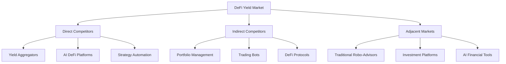
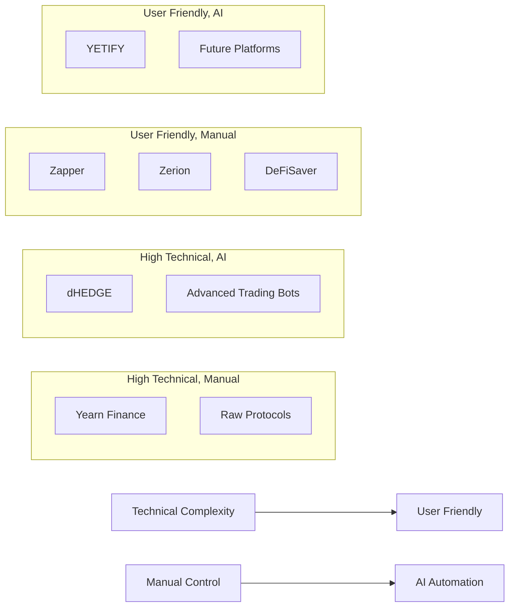
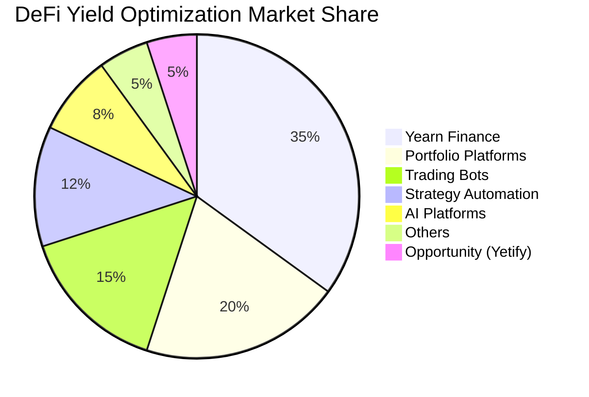

# 🥊 Yetify: Competitive Analysis & Market Positioning

**Strategic Market Analysis for AI-Powered DeFi Platform**  
*Positioning Yetify in the Evolving DeFi Landscape*

---

## 📊 **EXECUTIVE SUMMARY**

### **Market Landscape Overview**
The DeFi market has reached $200B+ in total value locked (TVL), but remains fragmented with high barriers to entry for average users. While numerous yield farming platforms exist, very few leverage advanced AI for strategy optimization, and none offer true natural language interfaces for strategy creation.

### **Competitive Advantage**
Yetify's unique positioning combines three critical elements that no single competitor addresses comprehensively:
1. **Natural Language Interface** - Simple prompt-based strategy creation
2. **Advanced AI Optimization** - LLM-powered strategy generation and optimization  
3. **Cross-Chain Execution** - Seamless multi-blockchain strategy deployment

### **Market Opportunity**
- **Total Addressable Market (TAM)**: $200B+ DeFi ecosystem
- **Serviceable Addressable Market (SAM)**: $50B yield optimization segment
- **Serviceable Obtainable Market (SOM)**: $2B AI-assisted DeFi segment

---

## 🎯 **COMPETITIVE LANDSCAPE OVERVIEW**

### **Market Categorization**

### **Competition Matrix Overview**

| Category | Players | Market Share | AI Integration | User Experience | Differentiation |
|----------|---------|--------------|----------------|-----------------|-----------------|
| **Yield Aggregators** | Yearn, Harvest, Badger | 35% | Low | Technical | APY Optimization |
| **AI DeFi Platforms** | dHEDGE, TokenSets | 8% | Medium | Moderate | Automated Strategies |
| **Strategy Automation** | DeFiSaver, Instadapp | 12% | Low | Good | Cross-Protocol |
| **Portfolio Management** | Zapper, Zerion | 20% | Low | Excellent | Interface & Analytics |
| **Trading Bots** | 3Commas, Pionex | 15% | Medium | Moderate | Automated Trading |
| **Yetify (Target)** | - | **5-10%** | **High** | **Excellent** | **NL + AI + Multi-Chain** |

---

## 🔍 **DIRECT COMPETITORS ANALYSIS**

### **1. Yearn Finance - Market Leader**

#### **🏢 Company Overview**
- **Founded**: 2020 by Andre Cronje
- **Market Cap**: $300M+ (YFI token)
- **TVL**: $500M+ across vaults
- **Users**: 50,000+ active users

#### **💪 Strengths**
- **Strong Brand**: Established leader in yield farming
- **Community**: Large, engaged developer and user community
- **Protocol Integration**: Deep relationships with major DeFi protocols
- **Security**: Battle-tested smart contracts with strong audit history
- **Yield Optimization**: Sophisticated automated yield strategies

#### **⚠️ Weaknesses**
- **Complex UX**: Requires significant DeFi knowledge
- **No AI Integration**: Manual strategy creation and limited optimization
- **Ethereum-Centric**: Limited multi-chain support
- **Technical Barriers**: High learning curve for new users
- **Gas Costs**: Expensive transactions on Ethereum mainnet

#### **🎯 Yetify's Advantage**
- **Natural Language Interface** vs. complex technical UI
- **AI-Powered Optimization** vs. static strategies
- **Multi-Chain Native** vs. Ethereum-focused
- **User-Friendly** vs. developer-oriented

### **2. dHEDGE - AI-Enhanced Protocol**

#### **🏢 Company Overview**
- **Founded**: 2020
- **Market Cap**: $50M+ (DHT token)
- **TVL**: $100M+ in managed assets
- **Users**: 5,000+ active managers

#### **💪 Strengths**
- **AI Integration**: Some machine learning for portfolio optimization
- **Social Trading**: Copy successful manager strategies
- **Multi-Asset**: Support for various crypto assets
- **Manager Incentives**: Performance-based fee structure

#### **⚠️ Weaknesses**
- **Limited AI**: Basic ML, not advanced LLM integration
- **Manager Dependency**: Relies on human strategy managers
- **Complex Interface**: Still requires DeFi knowledge
- **Limited Chains**: Primarily Ethereum and Polygon

#### **🎯 Yetify's Advantage**
- **Advanced AI** with LLM integration vs. basic ML
- **Direct User Control** vs. manager dependency
- **Natural Language** vs. technical interfaces
- **Broader Multi-Chain** support

### **3. TokenSets (Set Protocol) - Automated Strategies**

#### **🏢 Company Overview**
- **Founded**: 2019
- **Market Cap**: $100M+ ecosystem value
- **TVL**: $200M+ in sets
- **Users**: 15,000+ set holders

#### **💪 Strengths**
- **Strategy Automation**: Pre-built automated trading strategies
- **DeFi Integration**: Works with major DeFi protocols
- **Social Features**: Strategy sharing and following
- **Risk Management**: Built-in risk controls

#### **⚠️ Weaknesses**
- **Limited Customization**: Pre-built strategies only
- **No AI Optimization**: Rule-based automation only
- **Ethereum Only**: Single blockchain support
- **Complex Strategy Creation**: Requires technical knowledge

#### **🎯 Yetify's Advantage**
- **Custom AI Strategies** vs. pre-built templates
- **Natural Language Creation** vs. technical configuration
- **Cross-Chain Execution** vs. Ethereum-only
- **Continuous AI Optimization** vs. static rules

### **4. DeFiSaver - Strategy Management**

#### **🏢 Company Overview**
- **Founded**: 2019
- **Users**: 25,000+ active users
- **Focus**: DeFi position management and automation
- **Specialization**: Liquidation protection and optimization

#### **💪 Strengths**
- **User Experience**: Clean, intuitive interface
- **Automation**: Good position management automation
- **Multi-Protocol**: Works across major DeFi protocols
- **Safety Features**: Strong liquidation protection

#### **⚠️ Weaknesses**
- **No AI Integration**: Manual strategy configuration
- **Limited Yield Focus**: More about protection than optimization
- **Single Chain**: Ethereum-focused
- **Complex Strategies**: Still requires DeFi understanding

#### **🎯 Yetify's Advantage**
- **AI-Driven Strategy Creation** vs. manual configuration
- **Yield Optimization Focus** vs. protection-oriented
- **Natural Language Interface** vs. technical forms
- **Multi-Chain Strategy** vs. single blockchain

---

## 🔄 **INDIRECT COMPETITORS ANALYSIS**

### **Portfolio Management Platforms**

#### **Zapper - DeFi Dashboard Leader**
- **Strengths**: Excellent UI/UX, comprehensive portfolio tracking
- **Weaknesses**: No strategy automation, viewing-only platform
- **Opportunity**: Partner for portfolio visualization features

#### **Zerion - Mobile-First Portfolio**
- **Strengths**: Outstanding mobile experience, social features
- **Weaknesses**: Limited automation, no yield optimization
- **Opportunity**: Learn from mobile-first design approach

#### **DeBank - Asian Market Leader**
- **Strengths**: Strong presence in Asian markets
- **Weaknesses**: Limited strategy features, regional focus
- **Opportunity**: Geographic expansion learnings

### **Trading Bot Platforms**

#### **3Commas - Centralized Trading Bots**
- **Strengths**: User-friendly bot creation, good performance tracking
- **Weaknesses**: Centralized exchanges only, limited DeFi integration
- **Opportunity**: Apply user experience lessons to DeFi

#### **Pionex - Built-in Trading Bots**
- **Strengths**: Integrated bot functionality, low fees
- **Weaknesses**: Centralized platform, limited customization
- **Opportunity**: Benchmark automation features

### **Traditional Robo-Advisors**

#### **Betterment - Traditional Robo-Advisor**
- **Strengths**: Excellent user experience, automated rebalancing
- **Weaknesses**: Traditional assets only, no DeFi exposure
- **Opportunity**: Apply UX principles to crypto/DeFi space

#### **Wealthfront - AI-Powered Traditional Platform**
- **Strengths**: Advanced AI for portfolio optimization
- **Weaknesses**: Traditional markets only, regulatory constraints
- **Opportunity**: Adapt AI techniques for DeFi applications

---

## 📈 **COMPETITIVE POSITIONING ANALYSIS**

### **Feature Comparison Matrix**

| Feature | Yetify | Yearn | dHEDGE | TokenSets | DeFiSaver | Zapper |
|---------|--------|-------|--------|-----------|-----------|---------|
| **Natural Language Interface** | ✅ | ❌ | ❌ | ❌ | ❌ | ❌ |
| **AI Strategy Generation** | ✅ | ❌ | 🟡 | ❌ | ❌ | ❌ |
| **Multi-Chain Support** | ✅ | 🟡 | 🟡 | ❌ | ❌ | ✅ |
| **Automated Execution** | ✅ | ✅ | ✅ | ✅ | ✅ | ❌ |
| **Risk Assessment** | ✅ | 🟡 | ✅ | 🟡 | ✅ | ❌ |
| **Portfolio Analytics** | ✅ | 🟡 | ✅ | ✅ | 🟡 | ✅ |
| **Mobile App** | 🚧 | ❌ | 🟡 | ❌ | ❌ | ✅ |
| **User-Friendly UX** | ✅ | ❌ | 🟡 | 🟡 | ✅ | ✅ |
| **Custom Strategies** | ✅ | ❌ | 🟡 | ❌ | 🟡 | ❌ |
| **Real-time Optimization** | ✅ | ❌ | 🟡 | ❌ | ❌ | ❌ |

**Legend**: ✅ Full Support | 🟡 Partial Support | ❌ Not Available | 🚧 In Development

### **Market Positioning Map**

### **Unique Value Proposition Analysis**

#### **Yetify's Unique Combination**
1. **Natural Language + AI**: Only platform combining conversational interface with advanced AI
2. **Multi-Chain Native**: Built for cross-chain from the ground up
3. **Continuous Learning**: AI that improves strategies over time
4. **User-Centric Design**: Designed for non-technical users from day one

#### **Competitive Moats**
- **AI Technology**: Advanced LLM integration with RAG systems
- **User Experience**: Natural language interface lowers barriers significantly
- **Cross-Chain Expertise**: Native multi-chain architecture
- **Continuous Innovation**: Strong R&D focus on AI advancement

---

## 🎯 **GO-TO-MARKET STRATEGY VS COMPETITORS**

### **Differentiation Strategy**

#### **1. Technology Differentiation**
- **Advanced AI Integration**: LLM-powered strategy generation
- **Natural Language Processing**: Conversational strategy creation
- **Multi-Chain Architecture**: Native cross-chain optimization
- **Real-Time Learning**: Adaptive algorithms that improve over time

#### **2. User Experience Differentiation**
- **Accessibility**: No DeFi knowledge required
- **Simplicity**: Natural language replaces complex forms
- **Transparency**: Clear explanations of all strategy decisions
- **Mobile-First**: Optimized for mobile devices from launch

#### **3. Market Positioning**
- **Target Audience**: DeFi newcomers and busy professionals
- **Value Proposition**: "DeFi made simple through AI"
- **Messaging**: Democratizing access to sophisticated yield strategies
- **Brand Personality**: Approachable, intelligent, trustworthy

### **Competitive Response Strategies**

#### **Defensive Strategies**
- **Patent Applications**: Protect key AI and NLP innovations
- **Exclusive Partnerships**: Secure exclusive integrations with key protocols
- **Network Effects**: Build strong community and user base
- **Continuous Innovation**: Maintain technology leadership through R&D

#### **Offensive Strategies**
- **Market Education**: Educate users about AI-powered DeFi benefits
- **Feature Velocity**: Rapid feature development and deployment
- **Strategic Partnerships**: Partner with complementary platforms
- **User Acquisition**: Aggressive marketing to underserved segments

---

## 📊 **MARKET SHARE ANALYSIS & PROJECTIONS**

### **Current Market Distribution (2024)**

### **Projected Market Share (2026)**

| Platform Category | 2024 Share | 2026 Projection | Growth Driver |
|-------------------|------------|-----------------|---------------|
| **Traditional Yield Aggregators** | 35% | 25% | Declining due to UX complexity |
| **AI-Powered Platforms** | 8% | 25% | Rapid adoption of AI solutions |
| **Portfolio Management** | 20% | 20% | Stable utility-focused growth |
| **Strategy Automation** | 12% | 15% | Moderate growth in automation |
| **Trading Bots** | 15% | 10% | Shift to DeFi from CEX |
| **Yetify (Target)** | 0% | **10-15%** | **AI + UX innovation** |
| **Others/New Entrants** | 10% | 5% | Consolidation expected |

### **Growth Projections**

#### **Yetify Market Share Targets**
- **Year 1 (2024)**: 0.5% market share ($1M TVL)
- **Year 2 (2025)**: 3% market share ($1.5B TVL)
- **Year 3 (2026)**: 10% market share ($10B TVL)
- **Year 5 (2028)**: 20% market share ($50B TVL)

#### **Key Growth Drivers**
1. **AI Adoption**: Increasing acceptance of AI in financial decisions
2. **User Experience**: Lower barriers to DeFi entry
3. **Multi-Chain Growth**: Expansion beyond Ethereum ecosystem
4. **Institutional Adoption**: Enterprise and institutional user growth

---

## ⚡ **COMPETITIVE THREATS & MITIGATION**

### **High-Priority Threats**

#### **1. Big Tech Entry**
- **Threat**: Google, Microsoft, or Meta entering AI DeFi space
- **Probability**: Medium (30-40%)
- **Impact**: High
- **Mitigation**: 
  - Focus on DeFi-specific expertise
  - Build strong community and network effects
  - Establish exclusive protocol partnerships
  - Maintain innovation velocity

#### **2. Existing Platform AI Integration**
- **Threat**: Yearn or Zapper adding AI capabilities
- **Probability**: High (60-70%)
- **Impact**: Medium-High
- **Mitigation**:
  - Maintain technology leadership
  - Patent key innovations
  - Build superior user experience
  - Expand feature set beyond basic AI

#### **3. Traditional Finance Disruption**
- **Threat**: Banks or traditional robo-advisors entering DeFi
- **Probability**: Medium (40-50%)
- **Impact**: Medium
- **Mitigation**:
  - Leverage regulatory agility
  - Focus on crypto-native features
  - Build strong DeFi ecosystem relationships
  - Emphasize decentralization benefits

### **Medium-Priority Threats**

#### **4. New AI-First Competitors**
- **Threat**: Well-funded startups building similar solutions
- **Probability**: High (70-80%)
- **Impact**: Medium
- **Mitigation**:
  - First-mover advantage
  - Superior execution and user experience
  - Strong team and investor backing
  - Network effects and community building

#### **5. Protocol-Level Integration**
- **Threat**: Major protocols building AI optimization natively
- **Probability**: Medium (30-40%)
- **Impact**: Medium
- **Mitigation**:
  - Cross-protocol optimization focus
  - Superior aggregation capabilities
  - User experience differentiation
  - Partnership rather than competition approach

### **Risk Mitigation Strategies**

#### **Technology Leadership**
- **Continuous R&D**: 20% of resources dedicated to innovation
- **Patent Portfolio**: File patents for key technological innovations
- **Open Source Strategy**: Contribute to ecosystem while protecting core IP
- **Academic Partnerships**: Collaborate with universities for cutting-edge research

#### **Market Position Defense**
- **Network Effects**: Build strong user and developer communities
- **Switching Costs**: Create valuable user data and personalization
- **Exclusive Partnerships**: Secure strategic integrations
- **Brand Building**: Establish thought leadership in AI DeFi space

---

## 🚀 **COMPETITIVE ADVANTAGE SUSTAINABILITY**

### **Sustainable Competitive Advantages**

#### **1. Technical Moats**
- **AI Expertise**: Deep expertise in LLM applications for finance
- **Multi-Chain Architecture**: Purpose-built for cross-chain optimization
- **Data Network Effects**: Proprietary strategy performance data
- **Continuous Learning**: Self-improving AI algorithms

#### **2. User Experience Moats**
- **Natural Language Processing**: Superior conversational interfaces
- **Accessibility**: Unmatched ease of use for non-technical users
- **Mobile Optimization**: Best-in-class mobile experience
- **Personalization**: AI-powered personalized recommendations

#### **3. Business Model Moats**
- **Network Effects**: Value increases with more users and strategies
- **Data Advantages**: Proprietary performance and user behavior data
- **Ecosystem Integration**: Deep integration with DeFi protocols
- **Community Building**: Strong developer and user communities

### **Innovation Roadmap**

#### **Short-term (6-12 months)**
- **Advanced AI Features**: Predictive market analysis, risk modeling
- **Cross-Chain Expansion**: Support for 5+ major blockchain networks
- **Mobile Application**: Native iOS and Android applications
- **Enterprise Features**: Institutional-grade tools and compliance

#### **Medium-term (1-2 years)**
- **Autonomous Agents**: Fully autonomous strategy management
- **Predictive Analytics**: Market prediction and trend analysis
- **Social Features**: Strategy sharing and community insights
- **DeFi Innovation**: New protocol integrations and features

#### **Long-term (2-5 years)**
- **AI Marketplace**: Community-developed AI agents and strategies
- **Cross-Protocol Innovation**: Novel DeFi protocol development
- **Global Expansion**: International markets and regulatory compliance
- **Platform Evolution**: Next-generation financial AI platform

---

## 📋 **COMPETITIVE INTELLIGENCE FRAMEWORK**

### **Monitoring & Analysis Systems**

#### **Competitor Tracking**
- **Weekly Monitoring**: Product updates, feature releases, announcements
- **Monthly Analysis**: Market share, user growth, TVL changes
- **Quarterly Reviews**: Strategic direction, partnerships, funding
- **Annual Assessment**: Comprehensive competitive landscape review

#### **Data Sources**
- **Public Information**: GitHub, blogs, social media, press releases
- **Market Data**: DeFiPulse, CoinGecko, token metrics, TVL tracking
- **User Intelligence**: Community feedback, user surveys, support insights
- **Industry Reports**: Research firm reports, conference presentations

#### **Analysis Framework**
- **SWOT Analysis**: Strengths, weaknesses, opportunities, threats
- **Feature Comparison**: Regular feature matrix updates
- **Market Positioning**: Competitive positioning map updates
- **Threat Assessment**: Risk evaluation and mitigation planning

### **Response Protocols**

#### **Competitive Response Decision Tree**
1. **Threat Assessment**: Evaluate competitive threat level
2. **Impact Analysis**: Assess potential business impact
3. **Response Strategy**: Develop appropriate response plan
4. **Resource Allocation**: Assign team and budget resources
5. **Execution Timeline**: Implement response with clear timeline
6. **Monitoring**: Track response effectiveness and adjust

#### **Response Categories**
- **Immediate Response**: Critical threats requiring immediate action
- **Strategic Response**: Medium-term competitive positioning
- **Innovation Response**: Long-term technology and product development
- **Market Response**: Marketing and positioning adjustments

---

## 🎯 **COMPETITIVE CONCLUSION**

*Yetify operates in a rapidly evolving competitive landscape with significant opportunities for differentiation through AI innovation and user experience excellence. Our unique combination of natural language interfaces, advanced AI optimization, and multi-chain capabilities positions us to capture significant market share in the growing DeFi ecosystem.*

### **Key Success Factors**

| Factor | Strategy | Timeline | Success Metric |
|--------|----------|----------|----------------|
| **Technology Leadership** | Continuous AI innovation | Ongoing | Feature differentiation maintained |
| **User Experience** | Best-in-class UX/UI | 6 months | >4.5 App Store rating |
| **Market Position** | First-mover in AI DeFi | 12 months | 5%+ market share |
| **Community Building** | Strong ecosystem presence | 18 months | 10,000+ active users |

### **Competitive Monitoring Dashboard**

**Next Review Date**: [Current Date + 3 months]  
**Review Owner**: Product Strategy Team  
**Distribution**: Leadership Team, Product Team, Marketing Team

---

**Competitive Intelligence Contact**: strategy@yetify.ai  
**Market Research Updates**: [Monthly Competitive Newsletter](https://newsletter.yetify.ai/competitive)  
**Strategic Planning**: [Quarterly Business Reviews](https://yetify.ai/strategy)

*"In a rapidly evolving market, our competitive advantage lies not just in what we build today, but in how quickly we learn, adapt, and innovate for tomorrow."*

**© 2024 Yetify Inc. - Competitive Analysis Framework**

