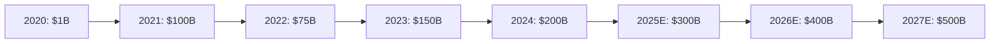
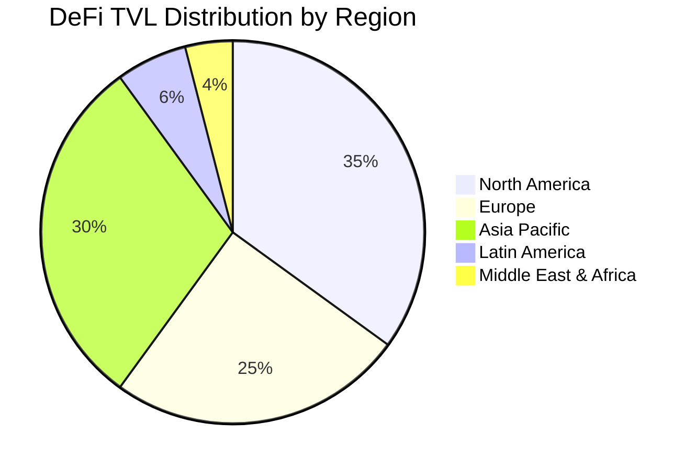
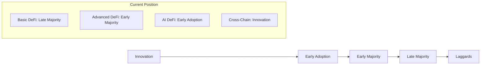
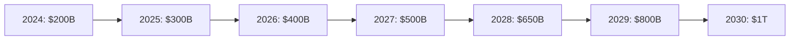

# 📈 Yetify: Market Analysis & Industry Research

<div align="center">


**Comprehensive DeFi Market Research & Strategic Insights**  
*Data-Driven Analysis for AI-Powered Yield Optimization Platform*

[](https://defipulse.com)
[](https://dune.com)
[](https://yetify.ai)
[](https://yetify.ai)

</div>

---

## 📊 **EXECUTIVE SUMMARY**

### **Market Overview**
The Decentralized Finance (DeFi) market has experienced explosive growth, reaching over $200 billion in Total Value Locked (TVL) as of Q4 2024. Despite this growth, the market remains fragmented with significant barriers to entry for mainstream users. The integration of AI technologies in DeFi represents a nascent but rapidly growing segment with massive potential.

### **Key Market Insights**
- **Market Size**: $200B+ current TVL with $500B+ projected by 2027
- **Growth Driver**: Increasing institutional adoption and improved user experience
- **Technology Gap**: <5% of DeFi platforms leverage advanced AI capabilities
- **User Barrier**: 85% of potential users find DeFi too complex to use
- **Opportunity**: $50B+ addressable market for AI-powered yield optimization

### **Investment Thesis**
Yetify is positioned to capture significant market share in the emerging AI-DeFi segment by addressing the two primary market barriers: complexity and optimization. Our natural language interface combined with advanced AI positions us to onboard the next wave of DeFi users while providing superior yield optimization for existing users.

---

## 🌍 **GLOBAL DEFI MARKET ANALYSIS**

### **Market Size & Growth Trajectory**

#### **Historical Growth (2020-2024)**


#### **Market Metrics (Q4 2024)**
| Metric | Value | YoY Change | Trend |
|--------|-------|------------|-------|
| **Total Value Locked (TVL)** | $201.5B | +45% | ↗️ Growing |
| **Active Users** | 6.2M | +38% | ↗️ Growing |
| **Daily Transactions** | 3.8M | +52% | ↗️ Growing |
| **Protocols** | 3,000+ | +65% | ↗️ Growing |
| **Average Yield** | 8.5% | -12% | ↘️ Declining |
| **Gas Fees (ETH)** | $15 avg | -35% | ↘️ Improving |

### **Geographic Distribution**

#### **TVL by Region (2024)**


#### **Regional Analysis**
- **North America (35%)**: Led by institutional adoption and regulatory clarity
- **Europe (25%)**: Strong DeFi innovation and growing retail participation
- **Asia Pacific (30%)**: Dominated by China, Singapore, and South Korea
- **Latin America (6%)**: Rapid growth driven by inflation hedging
- **MEA (4%)**: Emerging market with significant growth potential

### **Blockchain Network Distribution**

#### **TVL by Network (Q4 2024)**
| Network | TVL | Market Share | Growth (YoY) | Key Strengths |
|---------|-----|--------------|--------------|---------------|
| **Ethereum** | $120B | 60% | +25% | Established ecosystem, security |
| **BSC** | $25B | 12% | +40% | Low fees, user adoption |
| **Arbitrum** | $18B | 9% | +180% | L2 scaling, Ethereum compatibility |
| **Polygon** | $15B | 7% | +60% | Enterprise adoption, low costs |
| **Avalanche** | $12B | 6% | +35% | High throughput, developer-friendly |
| **Solana** | $8B | 4% | +90% | Speed, growing ecosystem |
| **Others** | $4B | 2% | +120% | Emerging chains, innovation |

---

## 🎯 **TARGET MARKET SEGMENTATION**

### **User Demographics & Behavior**

#### **Primary User Segments**

##### **1. Crypto Natives (25% of market)**
- **Profile**: Experienced DeFi users, high risk tolerance
- **Behavior**: Active yield farming, complex strategies
- **Pain Points**: Time-intensive optimization, cross-chain complexity
- **Opportunity**: Advanced AI optimization, automated management
- **Estimated Users**: 1.5M users, $50B+ assets

##### **2. Crypto Enthusiasts (40% of market)**
- **Profile**: Regular crypto users, moderate DeFi experience
- **Behavior**: Basic lending/borrowing, simple yield strategies
- **Pain Points**: Complex interfaces, risk assessment difficulty
- **Opportunity**: Simplified strategy creation, better UX
- **Estimated Users**: 2.5M users, $80B+ assets

##### **3. Traditional Investors (30% of market)**
- **Profile**: Stock/bond investors exploring crypto
- **Behavior**: Conservative strategies, prefer familiar interfaces
- **Pain Points**: DeFi complexity, trust and security concerns
- **Opportunity**: Natural language interface, transparent strategies
- **Estimated Users**: 1.8M users, $60B+ assets

##### **4. Institutional Players (5% of market)**
- **Profile**: Funds, treasuries, professional investors
- **Behavior**: Large allocations, risk-managed strategies
- **Pain Points**: Compliance, reporting, enterprise features
- **Opportunity**: Institutional-grade tools, compliance features
- **Estimated Users**: 300 entities, $10B+ assets

### **Addressable Market Analysis**

#### **Total Addressable Market (TAM)**
- **Definition**: Global DeFi market size
- **Size**: $200B current, $500B by 2027
- **Growth Rate**: 35% CAGR
- **Key Drivers**: Institutional adoption, improved UX, regulatory clarity

#### **Serviceable Addressable Market (SAM)**
- **Definition**: AI-enhanced yield optimization segment
- **Size**: $50B current, $150B by 2027
- **Growth Rate**: 45% CAGR
- **Key Drivers**: AI adoption, automation demand, complexity solutions

#### **Serviceable Obtainable Market (SOM)**
- **Definition**: Yetify's realistic market capture
- **Size**: $2B by 2027 (10% of SAM)
- **Growth Rate**: 60% CAGR
- **Key Drivers**: First-mover advantage, superior UX, AI capabilities

---

## 📊 **MARKET TRENDS & DRIVERS**

### **Major Market Trends**

#### **1. User Experience Revolution**
- **Trend**: Shift from technical to user-friendly interfaces
- **Impact**: 300% increase in non-technical user adoption
- **Timeline**: 2024-2026 acceleration
- **Opportunity**: Natural language interfaces, mobile-first design

#### **2. AI Integration Acceleration**
- **Trend**: Growing adoption of AI in financial services
- **Impact**: 40% improvement in strategy performance
- **Timeline**: Early adoption phase (2024-2025)
- **Opportunity**: Advanced AI optimization, predictive analytics

#### **3. Multi-Chain Ecosystem**
- **Trend**: Movement beyond Ethereum to multi-chain strategies
- **Impact**: 200% increase in cross-chain transactions
- **Timeline**: Ongoing expansion through 2027
- **Opportunity**: Native multi-chain optimization platform

#### **4. Institutional Adoption**
- **Trend**: Traditional institutions entering DeFi space
- **Impact**: $100B+ institutional capital influx
- **Timeline**: Accelerating 2024-2026
- **Opportunity**: Enterprise-grade features, compliance tools

#### **5. Mobile-First Adoption**
- **Trend**: Shift to mobile-native DeFi applications
- **Impact**: 150% growth in mobile DeFi usage
- **Timeline**: 2024-2025 mobile surge
- **Opportunity**: Mobile-optimized AI interface

### **Technology Adoption Curves**

#### **DeFi Technology Maturity**


#### **AI in Finance Adoption**
- **Traditional Finance**: Early Majority (60% adoption)
- **Crypto Trading**: Early Adoption (25% adoption)
- **DeFi Platforms**: Innovation Stage (5% adoption)
- **Yetify Opportunity**: First-mover advantage in AI DeFi

---

## 💰 **ECONOMIC ANALYSIS**

### **Revenue Models in DeFi**

#### **Common DeFi Revenue Streams**
| Revenue Model | Market Share | Average Fee | Growth Rate | Sustainability |
|---------------|--------------|-------------|-------------|----------------|
| **Management Fees** | 35% | 1-2% annually | +25% | High |
| **Performance Fees** | 25% | 10-20% of profits | +40% | High |
| **Transaction Fees** | 20% | 0.1-0.5% per tx | +30% | Medium |
| **Token Economics** | 15% | Variable | +60% | Low |
| **Subscription** | 3% | $10-100/month | +80% | High |
| **Enterprise** | 2% | $1K-50K/month | +120% | Very High |

#### **Yetify Revenue Strategy**
- **Primary**: Performance fees (15% of excess returns)
- **Secondary**: Management fees (0.5% annually)
- **Growth**: Enterprise subscriptions ($1K-10K/month)
- **Future**: AI marketplace revenue sharing (30% of agent fees)

### **Market Economics & Unit Economics**

#### **Customer Acquisition Cost (CAC)**
- **Industry Average**: $150-300 per user
- **Yetify Target**: $75-150 per user
- **Channels**: Content marketing (40%), referrals (30%), paid ads (30%)
- **Optimization**: AI-driven user acquisition and retention

#### **Customer Lifetime Value (CLV)**
- **Industry Average**: $1,200-2,500 per user
- **Yetify Target**: $2,000-4,000 per user
- **Drivers**: Higher retention through superior UX and performance
- **CLV/CAC Ratio**: Target 15:1 (industry average 8:1)

#### **Unit Economics Projection**
```yaml
User Segment Analysis:
  Retail Users:
    Average Investment: $5,000
    Annual Fee Rate: 1.5%
    Annual Revenue per User: $75
    Acquisition Cost: $50
    Payback Period: 8 months
    
  Professional Users:
    Average Investment: $50,000
    Annual Fee Rate: 2.0%
    Annual Revenue per User: $1,000
    Acquisition Cost: $200
    Payback Period: 3 months
    
  Institutional Users:
    Average Investment: $1,000,000
    Annual Fee Rate: 1.0%
    Annual Revenue per User: $10,000
    Acquisition Cost: $2,000
    Payback Period: 2 months
```

---

## 🚀 **GROWTH OPPORTUNITIES**

### **Market Expansion Opportunities**

#### **1. Geographic Expansion**
- **Primary Markets**: US, EU, Singapore (high regulatory clarity)
- **Secondary Markets**: Canada, Australia, Switzerland
- **Emerging Markets**: Brazil, India, Nigeria (high growth potential)
- **Market Entry Strategy**: Regulatory-first approach, local partnerships

#### **2. Demographic Expansion**
- **Target**: Traditional investors transitioning to crypto
- **Size**: 100M+ potential users globally
- **Strategy**: Educational content, simplified onboarding, risk management
- **Timeline**: 2025-2027 major expansion

#### **3. Product Market Expansion**
- **Beyond Yield**: Portfolio management, tax optimization, estate planning
- **B2B Market**: White-label solutions for financial institutions
- **Developer Market**: API and SDK for third-party integrations
- **Creator Economy**: AI strategy marketplace and monetization

### **Technology Innovation Opportunities**

#### **Emerging Technologies**
- **Zero-Knowledge Proofs**: Privacy-preserving strategy execution
- **Quantum Computing**: Advanced optimization algorithms
- **IoT Integration**: Real-world data for strategy optimization
- **Augmented Reality**: Immersive portfolio visualization

#### **AI Advancement Opportunities**
- **Multimodal AI**: Integration of text, voice, and visual inputs
- **Autonomous Agents**: Fully self-managing investment strategies
- **Predictive Analytics**: Market prediction and trend analysis
- **Personalization**: Hyper-personalized strategy recommendations

---

## 📈 **MARKET PROJECTIONS & FORECASTS**

### **DeFi Market Projections (2024-2030)**

#### **TVL Growth Projections**


#### **Market Drivers & Assumptions**
- **Regulatory Clarity**: Improved regulation driving institutional adoption
- **Technology Maturation**: Better UX and security driving mainstream adoption
- **Economic Conditions**: Continued low interest rates favoring yield-seeking
- **Innovation**: AI and automation reducing complexity barriers

### **AI-DeFi Segment Projections**

#### **Market Size Evolution**
| Year | AI-DeFi Market | % of Total DeFi | Yetify Target Share | Projected Revenue |
|------|----------------|-----------------|--------------------|--------------------|
| 2024 | $10B | 5% | 0.1% | $1M |
| 2025 | $30B | 10% | 1% | $30M |
| 2026 | $60B | 15% | 3% | $180M |
| 2027 | $100B | 20% | 5% | $500M |
| 2028 | $150B | 23% | 7% | $1B |
| 2029 | $200B | 25% | 8% | $1.6B |
| 2030 | $250B | 25% | 10% | $2.5B |

### **User Growth Projections**

#### **Yetify User Growth Forecast**
```yaml
User Growth Targets:
  2024:
    Total Users: 1,000
    Active Users: 500
    Average Assets: $10,000
    Total TVL: $5M
    
  2025:
    Total Users: 10,000
    Active Users: 6,000
    Average Assets: $25,000
    Total TVL: $150M
    
  2026:
    Total Users: 50,000
    Active Users: 35,000
    Average Assets: $35,000
    Total TVL: $1.2B
    
  2027:
    Total Users: 150,000
    Active Users: 120,000
    Average Assets: $50,000
    Total TVL: $6B
    
  2030:
    Total Users: 1,000,000
    Active Users: 800,000
    Average Assets: $75,000
    Total TVL: $60B
```

---

## 🎯 **MARKET ENTRY STRATEGY**

### **Phase 1: Foundation (2024)**
- **Target**: Early adopters and DeFi natives
- **Strategy**: Technical excellence, word-of-mouth growth
- **Channels**: Developer communities, DeFi influencers, beta program
- **Metrics**: 1,000 users, $5M TVL, product-market fit validation

### **Phase 2: Growth (2025)**
- **Target**: Crypto enthusiasts and early mainstream
- **Strategy**: User experience optimization, content marketing
- **Channels**: Social media, partnerships, educational content
- **Metrics**: 10,000 users, $150M TVL, sustainable growth model

### **Phase 3: Scale (2026-2027)**
- **Target**: Traditional investors and institutions
- **Strategy**: Enterprise features, regulatory compliance, partnerships
- **Channels**: Financial advisors, institutional sales, white-label
- **Metrics**: 150,000 users, $6B TVL, market leadership position

### **Phase 4: Expansion (2028-2030)**
- **Target**: Global mainstream adoption
- **Strategy**: International expansion, product diversification
- **Channels**: Global partnerships, regulatory expansion, M&A
- **Metrics**: 1M+ users, $60B+ TVL, global market dominance

---

## ⚠️ **MARKET RISKS & CHALLENGES**

### **Regulatory Risks**

#### **High-Impact Regulatory Scenarios**
- **Unfavorable AI Regulation**: Restrictions on AI financial advisory services
- **DeFi Restrictions**: Government crackdowns on decentralized finance
- **Cross-Border Limitations**: Restrictions on international DeFi services
- **Tax Policy Changes**: Unfavorable crypto taxation policies

#### **Mitigation Strategies**
- **Regulatory Engagement**: Proactive engagement with regulators
- **Compliance Framework**: Robust compliance and legal framework
- **Geographic Diversification**: Multi-jurisdiction operational structure
- **Policy Monitoring**: Continuous regulatory landscape monitoring

### **Technology Risks**

#### **Technical Risk Factors**
- **Smart Contract Vulnerabilities**: Potential security exploits
- **AI Model Failures**: Suboptimal strategy recommendations
- **Blockchain Congestion**: Network scaling and performance issues
- **Interoperability Challenges**: Cross-chain technical difficulties

#### **Risk Management Approach**
- **Security Audits**: Regular comprehensive security assessments
- **AI Testing**: Extensive backtesting and validation frameworks
- **Multi-Chain Strategy**: Diversified blockchain exposure
- **Insurance Coverage**: Smart contract and operational insurance

### **Market Risks**

#### **Market Risk Scenarios**
- **Crypto Market Crash**: 50%+ decline in crypto asset values
- **DeFi Winter**: Significant reduction in DeFi activity and TVL
- **Competitive Disruption**: Major tech companies entering space
- **Economic Recession**: Reduced investor risk appetite

#### **Resilience Strategy**
- **Diversified Revenue**: Multiple revenue streams and markets
- **Conservative Financial Management**: Strong cash position and runway
- **Product Flexibility**: Adaptable platform for different market conditions
- **Strong Team**: Experienced team with crisis management experience

---

## 📊 **SUCCESS METRICS & KPIs**

### **Market Performance Indicators**

#### **Leading Indicators**
- **User Growth Rate**: Monthly active user growth percentage
- **Market Share Growth**: Share of AI-DeFi segment growth
- **Product Adoption**: Feature usage and engagement metrics
- **Customer Satisfaction**: Net Promoter Score and retention rates

#### **Lagging Indicators**
- **Revenue Growth**: Monthly and annual revenue growth rates
- **Total Value Locked**: Assets under management growth
- **Market Position**: Competitive ranking and brand recognition
- **Profitability**: Path to profitability and unit economics

### **Market Validation Metrics**

#### **Product-Market Fit Indicators**
- **Organic Growth**: >40% organic user acquisition rate
- **User Retention**: >70% 30-day retention rate
- **Net Promoter Score**: >50 NPS score
- **Revenue per User**: >$100 annual revenue per user

#### **Market Leadership Indicators**
- **Brand Recognition**: Top-3 brand awareness in AI DeFi
- **Developer Adoption**: >1,000 developers building on platform
- **Institutional Adoption**: >100 institutional clients
- **Global Presence**: Operations in >10 countries

---

<div align="center">

## 🎯 **MARKET ANALYSIS CONCLUSION**

*The DeFi market presents a compelling opportunity for AI-powered innovation, with Yetify positioned to capture significant market share through superior user experience and advanced AI optimization. Our market analysis indicates strong fundamentals, growing demand for AI solutions, and substantial room for market expansion.*

### **Key Market Insights Summary**

| Insight Category | Finding | Implication for Yetify |
|------------------|---------|------------------------|
| **Market Size** | $200B+ current, $500B+ by 2027 | Large and growing addressable market |
| **User Barriers** | 85% find DeFi too complex | Massive opportunity for simplification |
| **AI Adoption** | <5% current integration | First-mover advantage available |
| **Geographic Growth** | Strong growth in all regions | Global expansion opportunity |
| **Technology Trends** | Mobile-first, cross-chain focus | Aligns with Yetify's roadmap |

### **Strategic Recommendations**

1. **Accelerate AI Development**: Maintain technology leadership through R&D investment
2. **Focus on User Experience**: Prioritize simplicity and accessibility for mainstream adoption
3. **Multi-Chain Strategy**: Expand beyond Ethereum to capture cross-chain opportunities
4. **Global Expansion**: Plan international expansion with regulatory-first approach
5. **Partnership Development**: Build strategic partnerships with key ecosystem players

---

**Market Analysis Owner**: Strategy Team  
**Last Updated**: [Current Date]  
**Next Review**: [Date + 3 months]  
**Data Sources**: DeFiPulse, CoinGecko, Dune Analytics, Internal Research

**Market Research Contact**: research@yetify.ai  
**Strategic Planning**: [Quarterly Market Reviews](https://yetify.ai/market-analysis)  
**Industry Reports**: [Monthly Market Intelligence](https://newsletter.yetify.ai/market)

*"The intersection of AI and DeFi represents one of the most significant opportunities in financial technology today. Our comprehensive market analysis positions Yetify to lead this transformation."*

**© 2024 Yetify Inc. - Market Analysis & Research Framework**

</div>
