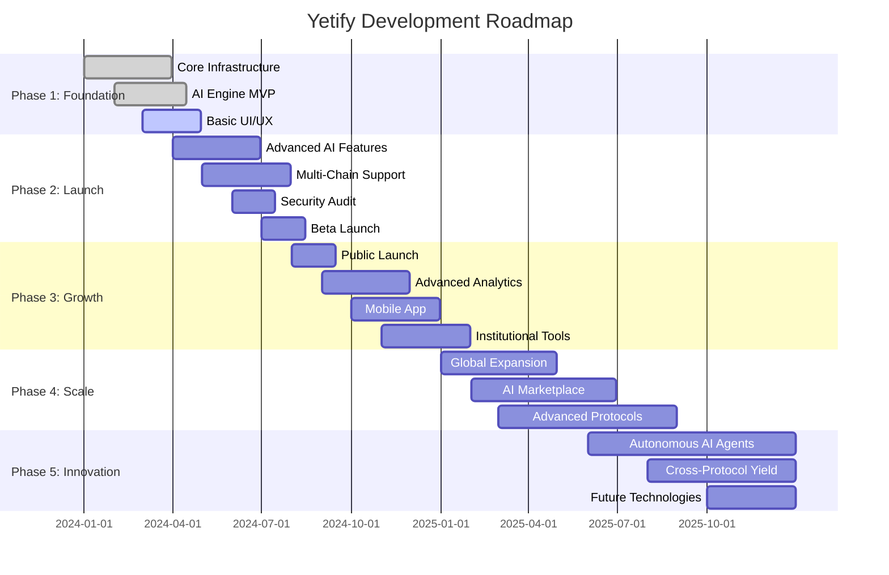
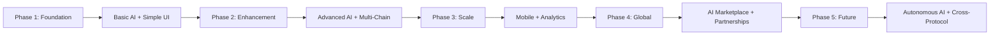

# 🗺️ Yetify: Product Roadmap & Development Timeline

**Strategic Development Plan for AI-Powered DeFi Platform**  
*From MVP to Market Leadership*

---

## 🎯 **VISION & STRATEGIC OBJECTIVES**

### **Mission Statement**
Transform the DeFi landscape by making yield optimization accessible to everyone through natural language interfaces and intelligent automation, establishing Yetify as the leading AI-powered yield optimization platform.

### **Strategic Goals (2024-2025)**
1. **🏗️ Foundation**: Build robust, secure, and scalable core platform
2. **🚀 Launch**: Successfully deploy MVP with initial user base
3. **📈 Growth**: Scale to 10,000+ active users and $50M+ TVL
4. **🌍 Expansion**: Multi-chain dominance across 5+ blockchain networks
5. **🤖 Innovation**: Advanced AI features with autonomous optimization
6. **🏆 Leadership**: Become the #1 AI-powered DeFi platform

---

## 📅 **ROADMAP OVERVIEW**

---

## 🏗️ **PHASE 1: FOUNDATION (Q1 2024 - Q2 2024)**

### **Overview**
Establish core infrastructure, basic AI capabilities, and foundational user experience. Focus on building a robust, secure, and scalable platform foundation.

### **🎯 Phase Goals**
- Complete core platform architecture
- Implement basic AI strategy generation
- Deploy MVP user interface
- Establish security frameworks
- Create comprehensive testing infrastructure

### **📦 Major Deliverables**

#### **🔧 Core Infrastructure (Week 1-8)**
- [x] **Backend Architecture**
  - Express.js + GraphQL API foundation
  - MongoDB database with optimized schemas
  - Redis caching layer implementation
  - Comprehensive logging and monitoring setup

- [x] **AI Integration Foundation**
  - OpenAI GPT-4 and Google Gemini integration
  - Basic prompt processing pipeline
  - Vector database setup (Pinecone/Weaviate)
  - Initial RAG implementation for market data

- [x] **Security Framework**
  - JWT authentication with wallet verification
  - Rate limiting and input validation
  - Encryption for sensitive data
  - Security audit preparation

#### **🎨 User Interface MVP (Week 6-12)**
- [ ] **Frontend Foundation**
  - Next.js 14 application with TypeScript
  - Responsive design with Tailwind CSS
  - Basic component library implementation
  - Mobile-first design approach

- [ ] **Core User Flows**
  - Wallet connection interface
  - Simple prompt input system
  - Basic strategy preview display
  - Essential dashboard components

#### **🧠 AI Engine MVP (Week 8-16)**
- [ ] **Strategy Generation**
  - Natural language prompt processing
  - Basic strategy creation algorithms
  - Risk assessment framework
  - Simple optimization logic

- [ ] **Market Data Integration**
  - Live price feed connections
  - Basic APY calculations
  - Protocol data aggregation
  - Historical data storage

### **🎯 Success Metrics**
- ✅ Complete platform architecture documentation
- ✅ Basic AI strategy generation (5+ strategy types)
- ✅ Functional wallet connection system
- ✅ 90%+ test coverage for core components
- ✅ Security audit readiness
- 🎯 Demo-ready MVP for stakeholder presentation

---

## 🚀 **PHASE 2: LAUNCH PREPARATION (Q2 2024 - Q3 2024)**

### **Overview**
Enhance AI capabilities, implement multi-chain support, complete security audits, and prepare for beta launch with early adopters.

### **🎯 Phase Goals**
- Advanced AI strategy optimization
- Multi-chain execution capabilities
- Comprehensive security audit completion
- Beta launch with 100+ users
- Performance optimization and scaling

### **📦 Major Deliverables**

#### **🤖 Advanced AI Features (Week 17-24)**
- [ ] **Enhanced Strategy Engine**
  - Multi-objective optimization algorithms
  - Advanced risk modeling and assessment
  - Real-time strategy adaptation
  - Personalized recommendation system

- [ ] **RAG System Enhancement**
  - Real-time market data injection
  - Historical performance analysis
  - Protocol-specific optimization
  - Cross-chain opportunity identification

#### **⛓️ Multi-Chain Infrastructure (Week 20-28)**
- [ ] **Blockchain Integration**
  - Ethereum mainnet support
  - NEAR protocol integration
  - Arbitrum deployment capabilities
  - Cross-chain bridging implementation

- [ ] **Smart Contract Deployment**
  - Vault contracts for each supported chain
  - Gas optimization strategies
  - Transaction batching and sequencing
  - Emergency pause and recovery systems

#### **🔒 Security & Audit (Week 24-32)**
- [ ] **Comprehensive Security Audit**
  - Third-party security firm engagement
  - Smart contract audit completion
  - Penetration testing execution
  - Vulnerability assessment and remediation

- [ ] **TEE Integration**
  - Trusted Execution Environment setup
  - Secure strategy execution implementation
  - Private key management system
  - Encrypted communication protocols

#### **🧪 Beta Launch Preparation (Week 28-36)**
- [ ] **Testing & QA**
  - End-to-end testing completion
  - Load testing and performance optimization
  - User acceptance testing with beta group
  - Bug fixes and stability improvements

- [ ] **Beta Program Launch**
  - Whitelist-based user onboarding
  - Limited strategy execution (max $10K per user)
  - Feedback collection and analysis system
  - Performance monitoring and optimization

### **🎯 Success Metrics**
- 🎯 Advanced AI generates 20+ strategy types
- 🎯 Multi-chain support (3+ networks)
- 🎯 Security audit completion with no critical issues
- 🎯 Beta launch with 100+ active users
- 🎯 Average strategy performance of 8%+ APY
- 🎯 Platform uptime of 99.5%+

---

## 📈 **PHASE 3: PUBLIC LAUNCH & GROWTH (Q3 2024 - Q1 2025)**

### **Overview**
Public platform launch, user acquisition campaigns, advanced analytics implementation, and initial scaling to thousands of users.

### **🎯 Phase Goals**
- Successful public launch with marketing campaign
- Scale to 1,000+ active users
- Achieve $5M+ total value locked (TVL)
- Implement advanced analytics and reporting
- Launch mobile applications

### **📦 Major Deliverables**

#### **🌟 Public Launch (Week 37-44)**
- [ ] **Marketing & Launch Campaign**
  - Go-to-market strategy execution
  - Influencer and partnership campaigns
  - Content marketing and educational resources
  - Community building and engagement

- [ ] **Platform Optimization**
  - Performance optimization for scale
  - User experience improvements
  - Advanced error handling and recovery
  - Customer support system implementation

#### **📊 Advanced Analytics (Week 40-48)**
- [ ] **Analytics Dashboard**
  - Real-time performance tracking
  - Advanced portfolio analytics
  - Risk assessment visualization
  - Comparative performance benchmarking

- [ ] **Reporting System**
  - Automated performance reports
  - Tax reporting assistance
  - Historical analysis tools
  - Export capabilities (PDF, CSV)

#### **📱 Mobile Applications (Week 44-52)**
- [ ] **Mobile Development**
  - iOS application development
  - Android application development
  - Push notification system
  - Offline capabilities for viewing

- [ ] **Mobile-Specific Features**
  - Simplified strategy creation
  - Mobile wallet integration
  - Quick portfolio overview
  - Alert and notification management

#### **🏢 Institutional Features (Week 48-56)**
- [ ] **Enterprise Tools**
  - Multi-user account management
  - Advanced permission systems
  - Institutional-grade reporting
  - API access for integration

- [ ] **Compliance Features**
  - KYC/AML integration
  - Regulatory reporting tools
  - Audit trail capabilities
  - Compliance dashboard

### **🎯 Success Metrics**
- 🎯 1,000+ active users within 3 months
- 🎯 $5M+ total value locked (TVL)
- 🎯 Average user retention rate of 70%+
- 🎯 Mobile app with 4.5+ App Store rating
- 🎯 95%+ customer satisfaction score
- 🎯 Break-even on operational costs

---

## 🌍 **PHASE 4: SCALE & EXPANSION (Q1 2025 - Q3 2025)**

### **Overview**
International expansion, advanced AI marketplace, protocol partnerships, and scaling to serve tens of thousands of users globally.

### **🎯 Phase Goals**
- International market expansion
- Advanced AI marketplace launch
- Strategic protocol partnerships
- Scale to 10,000+ users
- Achieve $50M+ TVL

### **📦 Major Deliverables**

#### **🌏 Global Expansion (Week 57-70)**
- [ ] **Internationalization**
  - Multi-language platform support
  - Regional compliance implementation
  - Local payment method integration
  - Regional marketing campaigns

- [ ] **Geographic Expansion**
  - European market entry
  - Asian market exploration
  - Regulatory compliance in multiple jurisdictions
  - Local partnership development

#### **🤖 AI Marketplace (Week 64-78)**
- [ ] **Strategy Marketplace**
  - Community-created strategy sharing
  - Strategy rating and review system
  - Monetization for strategy creators
  - Curated strategy collections

- [ ] **Advanced AI Features**
  - Custom model training options
  - Personalized AI assistants
  - Advanced backtesting capabilities
  - Predictive market analysis

#### **🤝 Protocol Partnerships (Week 70-84)**
- [ ] **DeFi Protocol Integration**
  - Native integrations with top 20 protocols
  - Exclusive partnership agreements
  - Early access to new opportunities
  - Co-marketing initiatives

- [ ] **Blockchain Expansion**
  - Polygon network integration
  - Avalanche support
  - Solana exploration
  - Cosmos ecosystem entry

### **🎯 Success Metrics**
- 🎯 10,000+ active users globally
- 🎯 $50M+ total value locked (TVL)
- 🎯 Expansion to 3+ international markets
- 🎯 100+ community-created strategies
- 🎯 Partnerships with 10+ major protocols
- 🎯 Market leadership in AI-powered DeFi

---

## 🔮 **PHASE 5: INNOVATION & FUTURE (Q3 2025 - Q4 2025)**

### **Overview**
Cutting-edge AI development, autonomous agent implementation, and positioning for future DeFi evolution and market leadership.

### **🎯 Phase Goals**
- Autonomous AI agent implementation
- Cross-protocol yield optimization
- Next-generation technology integration
- Market leadership consolidation
- Preparation for future expansions

### **📦 Major Deliverables**

#### **🤖 Autonomous AI Agents (Week 85-98)**
- [ ] **Autonomous Strategy Management**
  - Self-optimizing strategy algorithms
  - Autonomous rebalancing and adjustment
  - Predictive market position taking
  - Risk-adjusted autonomous trading

- [ ] **AI Agent Marketplace**
  - Specialized AI agents for different strategies
  - AI agent customization and training
  - Community-developed AI agents
  - Performance-based agent ranking

#### **🔗 Cross-Protocol Innovation (Week 91-104)**
- [ ] **Advanced Cross-Chain Optimization**
  - Cross-protocol arbitrage opportunities
  - Multi-chain liquidity optimization
  - Advanced bridge and swap integration
  - Cross-chain governance participation

- [ ] **Yield Aggregation 2.0**
  - Dynamic protocol switching
  - Multi-asset strategy optimization
  - Advanced risk diversification
  - Institutional-grade portfolio management

#### **🚀 Future Technology Integration (Week 97-110)**
- [ ] **Emerging Technology Support**
  - Zero-knowledge proof integration
  - Quantum-resistant security implementation
  - Advanced privacy features
  - Next-generation blockchain support

- [ ] **Research & Development**
  - AI/ML research partnerships
  - Academic collaboration programs
  - Open source contribution initiatives
  - Future technology exploration

### **🎯 Success Metrics**
- 🎯 Fully autonomous strategy management
- 🎯 Cross-protocol optimization achieving 15%+ APY
- 🎯 Market leadership in AI-powered DeFi
- 🎯 50,000+ active users globally
- 🎯 $500M+ total value locked (TVL)
- 🎯 Industry recognition as innovation leader

---

## 📊 **FEATURE DEVELOPMENT TIMELINE**

### **Core Features Progress**

| Feature Category | Phase 1 | Phase 2 | Phase 3 | Phase 4 | Phase 5 |
|------------------|---------|---------|---------|---------|---------|
| **AI Strategy Engine** | Basic Generation | Advanced Optimization | Personalization | Marketplace | Autonomous |
| **Multi-Chain Support** | Single Chain | 3+ Chains | Mobile Integration | 5+ Chains | Cross-Protocol |
| **User Interface** | MVP Dashboard | Enhanced UX | Mobile Apps | Global Localization | AI Assistants |
| **Security** | Basic Framework | Audit Complete | Enterprise Features | Advanced Privacy | Quantum-Ready |
| **Analytics** | Basic Metrics | Advanced Reporting | Real-time Insights | Predictive Analytics | AI-Driven |
| **Integrations** | Core Protocols | Top 10 Protocols | 20+ Protocols | Global Partnerships | Universal Access |

### **Technology Evolution**

---

## 🎯 **KEY PERFORMANCE INDICATORS (KPIs)**

### **Technical KPIs**

| Metric | Phase 1 Target | Phase 2 Target | Phase 3 Target | Phase 4 Target | Phase 5 Target |
|--------|---------------|---------------|---------------|---------------|---------------|
| **Platform Uptime** | 99.0% | 99.5% | 99.9% | 99.95% | 99.99% |
| **Response Time** | < 1s | < 500ms | < 300ms | < 200ms | < 100ms |
| **Strategy Types** | 5+ | 20+ | 50+ | 100+ | 500+ |
| **Supported Chains** | 1 | 3 | 3 | 5 | 10+ |
| **Test Coverage** | 90% | 95% | 98% | 99% | 99.5% |

### **Business KPIs**

| Metric | Phase 1 Target | Phase 2 Target | Phase 3 Target | Phase 4 Target | Phase 5 Target |
|--------|---------------|---------------|---------------|---------------|---------------|
| **Active Users** | 50 | 100+ | 1,000+ | 10,000+ | 50,000+ |
| **Total Value Locked** | $100K | $500K | $5M | $50M | $500M |
| **User Retention (30d)** | 50% | 60% | 70% | 75% | 80% |
| **Average APY** | 6% | 8% | 10% | 12% | 15% |
| **Revenue** | $0 | $10K | $100K | $1M | $10M |

### **User Experience KPIs**

| Metric | Phase 1 Target | Phase 2 Target | Phase 3 Target | Phase 4 Target | Phase 5 Target |
|--------|---------------|---------------|---------------|---------------|---------------|
| **Time to First Strategy** | < 10 min | < 5 min | < 3 min | < 2 min | < 1 min |
| **Strategy Success Rate** | 70% | 80% | 85% | 90% | 95% |
| **Customer Satisfaction** | 3.5/5 | 4.0/5 | 4.5/5 | 4.7/5 | 4.9/5 |
| **Support Ticket Volume** | < 20% | < 15% | < 10% | < 5% | < 2% |
| **Mobile App Rating** | N/A | N/A | 4.0+ | 4.5+ | 4.8+ |

---

## 🎪 **MAJOR MILESTONES & RELEASES**

### **🚀 Release Schedule**

#### **Alpha Release (Phase 1 - Month 3)**
- **Target Date**: March 2024
- **Scope**: Internal testing and core team validation
- **Features**: Basic AI strategy generation, simple UI
- **Users**: 10 internal testers
- **Goal**: Validate core concept and technical feasibility

#### **Beta Release (Phase 2 - Month 6)**
- **Target Date**: June 2024
- **Scope**: Whitelist-based external testing
- **Features**: Multi-chain support, enhanced AI, security audit
- **Users**: 100 beta testers
- **Goal**: User feedback, performance optimization, bug fixes

#### **Public Launch (Phase 3 - Month 9)**
- **Target Date**: September 2024
- **Scope**: General public availability
- **Features**: Full platform, mobile apps, advanced analytics
- **Users**: 1,000+ target users
- **Goal**: Market entry, user acquisition, revenue generation

#### **Enterprise Launch (Phase 4 - Month 15)**
- **Target Date**: March 2025
- **Scope**: Institutional features and global expansion
- **Features**: Enterprise tools, international support
- **Users**: 10,000+ target users
- **Goal**: Market leadership, institutional adoption

#### **Innovation Release (Phase 5 - Month 21)**
- **Target Date**: September 2025
- **Scope**: Autonomous AI and advanced features
- **Features**: Autonomous agents, cross-protocol optimization
- **Users**: 50,000+ target users
- **Goal**: Technology leadership, future market positioning

---

## 🔄 **CONTINUOUS IMPROVEMENT & FEEDBACK LOOPS**

### **User Feedback Integration**
- **Weekly User Interviews**: Direct feedback from active users
- **Monthly Surveys**: Quantitative user satisfaction metrics
- **Quarterly Focus Groups**: Deep dive into user experience
- **Continuous Analytics**: Real-time user behavior analysis

### **Market Research & Adaptation**
- **Monthly Competitor Analysis**: Market positioning updates
- **Quarterly Market Research**: Industry trend analysis
- **Semi-annual Strategy Review**: Roadmap adjustment sessions
- **Annual Vision Planning**: Long-term strategic planning

### **Technology Innovation Tracking**
- **Weekly Tech Trend Review**: Emerging technology assessment
- **Monthly R&D Sessions**: Innovation opportunity exploration
- **Quarterly Technology Audits**: Current stack optimization
- **Annual Technology Strategy**: Long-term tech evolution planning

---

## 🛡️ **RISK MANAGEMENT & CONTINGENCY PLANNING**

### **Technical Risks**

| Risk | Probability | Impact | Mitigation Strategy |
|------|------------|--------|-------------------|
| **AI Model Performance** | Medium | High | Multiple model providers, fallback systems |
| **Security Vulnerabilities** | Low | Critical | Continuous audits, bug bounty programs |
| **Scalability Issues** | Medium | High | Load testing, auto-scaling infrastructure |
| **Blockchain Network Issues** | High | Medium | Multi-chain support, redundant providers |

### **Business Risks**

| Risk | Probability | Impact | Mitigation Strategy |
|------|------------|--------|-------------------|
| **Regulatory Changes** | High | High | Legal counsel, compliance framework |
| **Market Competition** | High | Medium | Unique value proposition, innovation focus |
| **User Adoption** | Medium | High | Strong UX, marketing campaigns |
| **Economic Downturns** | Medium | High | Diversified revenue streams, cost flexibility |

### **Contingency Plans**
- **Emergency Response Team**: 24/7 incident response capability
- **Backup Systems**: Redundant infrastructure and data backups
- **Communication Protocols**: Clear stakeholder communication plans
- **Recovery Procedures**: Detailed system recovery and business continuity plans

---

## 📞 **ROADMAP GOVERNANCE & UPDATES**

### **Review Schedule**
- **Weekly Progress Reviews**: Development team sync
- **Monthly Milestone Assessment**: Phase progress evaluation
- **Quarterly Roadmap Review**: Strategic direction confirmation
- **Semi-annual Vision Alignment**: Stakeholder alignment sessions

### **Decision-Making Process**
1. **Proposal**: Feature or direction change proposal
2. **Analysis**: Impact and feasibility assessment
3. **Stakeholder Review**: Key stakeholder input collection
4. **Decision**: Final decision by leadership team
5. **Communication**: Update to all stakeholders
6. **Implementation**: Execute approved changes

### **Version Control**
- **Document Version**: Track all roadmap changes
- **Change Log**: Detailed record of all modifications
- **Approval Process**: Formal approval for major changes
- **Distribution**: Ensure all stakeholders have current version

---

## 🎯 **ROADMAP SUCCESS COMMITMENT**

*Yetify is committed to delivering on this roadmap while maintaining the flexibility to adapt to market needs and technological advancements. Our success is measured not just by feature delivery, but by user satisfaction, market impact, and technological innovation.*

**Roadmap Owner**: Product Team  
**Last Updated**: [Current Date]  
**Next Review**: [Date + 4 weeks]  
**Version**: 1.0

---

### 📊 **Current Progress Dashboard**

| Phase | Status | Completion | Next Milestone |
|-------|--------|------------|----------------|
| **Phase 1: Foundation** | 🟢 Active | 75% | Beta Preparation |
| **Phase 2: Launch** | 🟡 Planned | 0% | Security Audit |
| **Phase 3: Growth** | ⚪ Future | 0% | Public Launch |
| **Phase 4: Scale** | ⚪ Future | 0% | Global Expansion |
| **Phase 5: Innovation** | ⚪ Future | 0% | Autonomous AI |

**🎯 On Track for Q3 2024 Beta Launch**

