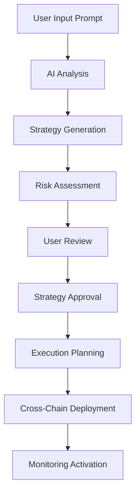
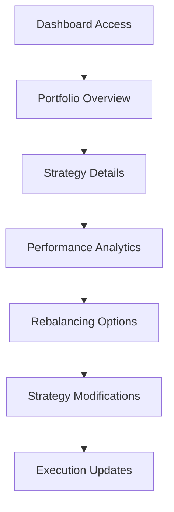

# 📋 Yetify: Scope of Work & Project Specification

<div align="center">


**AI-Powered DeFi Yield Strategy Platform**  
*Transforming Natural Language into Executable Multi-Chain Strategies*

[](https://github.com/Yetifi/Yetify-agent)
[](https://github.com/Yetifi/Yetify-agent/releases)
[](LICENSE)

</div>

---

## 🎯 **PROJECT OVERVIEW**

### **Mission Statement**
Yetify democratizes DeFi yield optimization by enabling users to express their investment intentions in natural language and receive automated, intelligent execution across multiple blockchain networks.

### **Core Value Proposition**
- **Accessibility**: No coding or DeFi expertise required
- **Intelligence**: AI-powered strategy generation and optimization
- **Automation**: Set-and-forget yield farming with continuous monitoring
- **Security**: Enterprise-grade security with TEE execution
- **Multi-Chain**: Seamless operations across major blockchain networks

---

## 🏗️ **PROJECT ARCHITECTURE & DELIVERABLES**

### **1. Frontend Application**

#### **1.1 Prompt-Based Strategy Builder**
- **Scope**: Natural language interface for strategy creation
- **Features**:
  - Intuitive text input with smart suggestions
  - Real-time strategy preview and validation
  - Risk assessment and expected returns display
  - Strategy customization and fine-tuning options
- **Technology**: Next.js 14, TypeScript, Tailwind CSS
- **Deliverables**:
  - Responsive web application
  - Mobile-optimized interface
  - Accessibility compliance (WCAG 2.1)
  - Multi-language support (EN, ES, ZH, JP)

#### **1.2 Wallet Integration**
- **Scope**: Secure multi-wallet connectivity
- **Features**:
  - NEAR Wallet integration
  - MetaMask support
  - WalletConnect compatibility
  - Hardware wallet support (Ledger, Trezor)
- **Security**: 
  - Non-custodial design
  - Transaction signing verification
  - Encrypted local storage
- **Deliverables**:
  - Wallet connection components
  - Transaction management system
  - Balance tracking and display

#### **1.3 Strategy Dashboard**
- **Scope**: Comprehensive portfolio management interface
- **Features**:
  - Real-time performance metrics
  - Portfolio allocation visualization
  - Active strategy monitoring
  - Historical performance analytics
  - Risk assessment displays
- **Deliverables**:
  - Interactive charts and graphs
  - Customizable dashboard layouts
  - Export functionality (PDF, CSV)
  - Alert and notification system

### **2. Backend Infrastructure**

#### **2.1 AI Strategy Engine**
- **Scope**: Core artificial intelligence system for strategy generation
- **Components**:
  - **LLM Integration**: OpenAI GPT-4, Google Gemini, Anthropic Claude
  - **RAG System**: Real-time data injection from multiple sources
  - **Vector Database**: Pinecone/Weaviate for strategy knowledge base
  - **Strategy Validation**: Risk assessment and feasibility checking
- **Deliverables**:
  - AI model training and fine-tuning
  - Natural language processing pipeline
  - Strategy generation algorithms
  - Continuous learning system

#### **2.2 Multi-Chain Execution Layer**
- **Scope**: Cross-chain strategy deployment and management
- **Supported Networks**:
  - Ethereum Mainnet
  - NEAR Protocol
  - Arbitrum
  - Polygon (Future)
  - Avalanche (Future)
- **Components**:
  - Smart contract deployment system
  - Cross-chain bridging integration
  - Gas optimization algorithms
  - Transaction monitoring and retry logic
- **Deliverables**:
  - Vault smart contracts (Solidity + Rust)
  - Execution engine implementation
  - Cross-chain communication protocols
  - Gas fee optimization system

#### **2.3 Real-Time Monitoring System**
- **Scope**: Continuous performance tracking and optimization
- **Features**:
  - Live APY calculations
  - Risk metric monitoring
  - Market condition analysis
  - Automated rebalancing triggers
  - Performance alerts and notifications
- **Data Sources**:
  - Chainlink price feeds
  - Pyth Network oracles
  - DeFiPulse protocol data
  - CoinGecko market data
- **Deliverables**:
  - Monitoring dashboard
  - Alert system implementation
  - Performance analytics engine
  - Automated rebalancing logic

#### **2.4 API & Integration Layer**
- **Scope**: External system integration and developer tools
- **Components**:
  - RESTful API endpoints
  - GraphQL schema and resolvers
  - WebSocket real-time updates
  - Third-party integrations
- **Security Features**:
  - JWT authentication
  - Rate limiting
  - Input validation
  - API key management
- **Deliverables**:
  - Complete API documentation
  - SDK development (JavaScript/Python)
  - Integration examples
  - Developer portal

### **3. Security & Infrastructure**

#### **3.1 Security Framework**
- **Scope**: Enterprise-grade security implementation
- **Components**:
  - TEE (Trusted Execution Environment) integration
  - Multi-signature wallet support
  - Encryption at rest and in transit
  - Regular security audits
- **Compliance**:
  - SOC 2 Type II preparation
  - GDPR compliance
  - Know Your Customer (KYC) integration
  - Anti-Money Laundering (AML) checks
- **Deliverables**:
  - Security architecture documentation
  - Penetration testing reports
  - Compliance certification
  - Security incident response plan

#### **3.2 DevOps & Deployment**
- **Scope**: Production-ready infrastructure and deployment
- **Components**:
  - Docker containerization
  - Kubernetes orchestration
  - CI/CD pipeline implementation
  - Monitoring and alerting systems
- **Cloud Infrastructure**:
  - Multi-region deployment
  - Auto-scaling capabilities
  - Disaster recovery planning
  - Performance optimization
- **Deliverables**:
  - Infrastructure as Code (Terraform)
  - Deployment automation scripts
  - Monitoring dashboards
  - Backup and recovery procedures

---

## 🎯 **FUNCTIONAL REQUIREMENTS**

### **Core User Flows**

#### **1. Strategy Creation Flow**


**Acceptance Criteria**:
- User can input natural language investment goals
- System generates comprehensive strategy within 10 seconds
- Risk assessment provides clear, understandable metrics
- User can modify generated strategies before execution
- Execution happens automatically upon user approval

#### **2. Portfolio Management Flow**


**Acceptance Criteria**:
- Real-time portfolio value updates (< 5 second delay)
- Historical performance tracking with 1-minute granularity
- One-click strategy pausing/resuming
- Automated rebalancing with user-configurable thresholds
- Detailed transaction history and audit trails

### **Performance Requirements**

#### **System Performance**
- **Response Time**: API responses < 500ms (95th percentile)
- **Throughput**: Support 1,000+ concurrent users
- **Availability**: 99.9% uptime SLA
- **Scalability**: Auto-scale to handle 10x load increases

#### **AI Performance**
- **Strategy Generation**: Complete analysis within 10 seconds
- **Data Processing**: Real-time market data updates (< 30 seconds)
- **Optimization**: Rebalancing decisions within 2 minutes
- **Accuracy**: 85%+ strategy performance vs. benchmarks

---

## 🔧 **TECHNICAL SPECIFICATIONS**

### **Technology Stack**

#### **Frontend Stack**
```yaml
Framework: Next.js 14 (App Router)
Language: TypeScript 5.3+
Styling: Tailwind CSS 3.4+
UI Components: Radix UI + shadcn/ui
State Management: Zustand
Wallet Integration: Wagmi + NEAR API JS
Charts: Recharts + D3.js
Testing: Jest + Playwright
```

#### **Backend Stack**
```yaml
Runtime: Node.js 18+ (LTS)
Framework: Express.js 4.18+
API: GraphQL (Apollo Server) + REST
Database: MongoDB 7.0+ (Primary) + Redis 7.0+ (Cache)
ORM: Mongoose 8.0+
AI/ML: OpenAI SDK, Google AI SDK, LangChain
Vector DB: Pinecone (Production) / Weaviate (Alternative)
Blockchain: Ethers.js, NEAR SDK, Web3.js
Testing: Jest + Supertest
Monitoring: Prometheus + Grafana
```

#### **Infrastructure Stack**
```yaml
Containerization: Docker + Docker Compose
Orchestration: Kubernetes (Production)
Cloud Provider: AWS (Primary) / Google Cloud (Backup)
CI/CD: GitHub Actions
Monitoring: Prometheus + Grafana + Loki
Logging: Winston + ELK Stack
Security: Vault (Secrets) + GuardDuty (Threat Detection)
```

### **Database Design**

#### **Primary Collections (MongoDB)**
```typescript
// User Schema
interface User {
  id: string;
  walletAddress: string;
  email?: string;
  preferences: UserPreferences;
  riskProfile: RiskProfile;
  createdAt: Date;
  lastActive: Date;
}

// Strategy Schema
interface Strategy {
  id: string;
  userId: string;
  name: string;
  description: string;
  prompt: string;
  configuration: StrategyConfig;
  status: 'draft' | 'active' | 'paused' | 'completed';
  performance: PerformanceMetrics;
  createdAt: Date;
  updatedAt: Date;
}

// Transaction Schema
interface Transaction {
  id: string;
  strategyId: string;
  type: 'deposit' | 'withdraw' | 'swap' | 'stake';
  amount: string;
  asset: string;
  network: string;
  txHash: string;
  status: 'pending' | 'confirmed' | 'failed';
  timestamp: Date;
}
```

---

## 📊 **PROJECT TIMELINE & MILESTONES**

### **Phase 1: Foundation (Weeks 1-8)**
**Goal**: Establish core infrastructure and basic functionality

#### **Week 1-2: Project Setup**
- [ ] Repository setup and CI/CD pipeline
- [ ] Development environment configuration
- [ ] Initial architecture documentation
- [ ] Team onboarding and role assignment

#### **Week 3-4: Backend Foundation**
- [ ] Express.js server setup
- [ ] MongoDB database design and implementation
- [ ] User authentication system
- [ ] Basic API endpoint development

#### **Week 5-6: AI Integration**
- [ ] LLM API integration (OpenAI/Gemini)
- [ ] Basic prompt processing pipeline
- [ ] Strategy generation algorithm (MVP)
- [ ] Vector database setup for RAG

#### **Week 7-8: Frontend Foundation**
- [ ] Next.js application setup
- [ ] Basic UI components development
- [ ] Wallet connection implementation
- [ ] Simple strategy input interface

### **Phase 2: Core Features (Weeks 9-16)**
**Goal**: Implement primary user-facing features

#### **Week 9-10: Strategy Engine**
- [ ] Advanced AI strategy generation
- [ ] Risk assessment algorithms
- [ ] Strategy validation and optimization
- [ ] Real-time market data integration

#### **Week 11-12: Execution Layer**
- [ ] Smart contract development (Ethereum)
- [ ] NEAR protocol integration
- [ ] Cross-chain bridging implementation
- [ ] Transaction execution system

#### **Week 13-14: Dashboard Development**
- [ ] Portfolio overview interface
- [ ] Performance analytics dashboard
- [ ] Real-time monitoring display
- [ ] Strategy management controls

#### **Week 15-16: Integration & Testing**
- [ ] End-to-end integration testing
- [ ] Security audit preparation
- [ ] Performance optimization
- [ ] User acceptance testing

### **Phase 3: Advanced Features (Weeks 17-24)**
**Goal**: Enhanced functionality and production readiness

#### **Week 17-18: Advanced Monitoring**
- [ ] Automated rebalancing system
- [ ] Advanced analytics and reporting
- [ ] Alert and notification system
- [ ] Performance benchmarking

#### **Week 19-20: Security & Compliance**
- [ ] Security audit completion
- [ ] TEE integration for secure execution
- [ ] Compliance framework implementation
- [ ] Multi-signature wallet support

#### **Week 21-22: Multi-Chain Expansion**
- [ ] Arbitrum integration
- [ ] Additional protocol support
- [ ] Cross-chain optimization
- [ ] Gas fee optimization

#### **Week 23-24: Production Deployment**
- [ ] Production infrastructure setup
- [ ] Load testing and optimization
- [ ] Go-live preparation
- [ ] Post-launch monitoring setup

---

## 🧪 **TESTING & QUALITY ASSURANCE**

### **Testing Strategy**

#### **Automated Testing**
- **Unit Tests**: 90%+ code coverage requirement
- **Integration Tests**: API endpoint and database testing
- **End-to-End Tests**: Complete user journey validation
- **Performance Tests**: Load testing with Artillery/K6
- **Security Tests**: OWASP ZAP automated scanning

#### **Manual Testing**
- **User Acceptance Testing**: Real user scenario validation
- **Security Audits**: Third-party security assessment
- **Accessibility Testing**: WCAG 2.1 compliance verification
- **Cross-Browser Testing**: Chrome, Firefox, Safari, Edge
- **Mobile Testing**: iOS Safari, Android Chrome

#### **Testing Environments**
```yaml
Development: Local development with test databases
Staging: Production-like environment for integration testing
Pre-Production: Final testing environment with production data
Production: Live environment with comprehensive monitoring
```

### **Quality Gates**
- All tests must pass before deployment
- Code coverage must exceed 90%
- Security scans must show no high/critical vulnerabilities
- Performance tests must meet SLA requirements
- Code review approval from 2+ team members required

---

## 📈 **SUCCESS METRICS & KPIs**

### **Technical Metrics**
- **System Uptime**: 99.9% availability
- **Response Time**: < 500ms API response time
- **Error Rate**: < 0.1% error rate
- **Test Coverage**: > 90% code coverage
- **Security Score**: 0 high/critical vulnerabilities

### **Business Metrics**
- **User Acquisition**: 1,000+ registered users in first month
- **Strategy Creation**: 100+ active strategies
- **Total Value Locked (TVL)**: $1M+ under management
- **User Retention**: 70%+ 30-day retention rate
- **Performance**: 5%+ average APY improvement over benchmarks

### **User Experience Metrics**
- **Strategy Success Rate**: 85%+ strategies meet user expectations
- **Time to First Strategy**: < 5 minutes from registration
- **User Satisfaction Score**: 4.5+ out of 5
- **Support Ticket Volume**: < 5% of users require support
- **Feature Adoption**: 80%+ users try advanced features

---

## 🚀 **DEPLOYMENT & MAINTENANCE**

### **Deployment Strategy**
- **Blue-Green Deployment**: Zero-downtime deployments
- **Feature Flags**: Gradual feature rollout
- **Canary Releases**: Limited exposure testing
- **Automated Rollbacks**: Instant reversion capabilities

### **Monitoring & Alerting**
- **Application Monitoring**: Performance and error tracking
- **Infrastructure Monitoring**: Server and network health
- **Business Monitoring**: Key metric tracking
- **Security Monitoring**: Threat detection and response

### **Maintenance Windows**
- **Regular Updates**: Weekly non-breaking updates
- **Security Patches**: Emergency deployment within 24 hours
- **Major Releases**: Monthly with advance notice
- **Database Maintenance**: Quarterly optimization

---

## 📋 **DELIVERABLES CHECKLIST**

### **Phase 1 Deliverables**
- [ ] Project setup and CI/CD pipeline
- [ ] Backend API foundation
- [ ] Database schema and models
- [ ] Basic AI integration
- [ ] Frontend application framework
- [ ] Wallet connection system
- [ ] Initial documentation

### **Phase 2 Deliverables**
- [ ] Complete AI strategy engine
- [ ] Multi-chain execution system
- [ ] Portfolio dashboard
- [ ] Real-time monitoring
- [ ] User management system
- [ ] API documentation
- [ ] Testing framework

### **Phase 3 Deliverables**
- [ ] Advanced analytics system
- [ ] Security audit completion
- [ ] Production deployment
- [ ] Performance optimization
- [ ] Comprehensive documentation
- [ ] User training materials
- [ ] Support system setup

---

## 🤝 **STAKEHOLDER RESPONSIBILITIES**

### **Development Team**
- Daily development work and code commits
- Participation in code reviews
- Writing and maintaining tests
- Documentation updates
- Bug fixes and issue resolution

### **Product Team**
- Requirements definition and refinement
- User story creation and prioritization
- Feature specification and acceptance criteria
- User experience design and validation
- Go-to-market strategy development

### **DevOps Team**
- Infrastructure setup and maintenance
- CI/CD pipeline management
- Monitoring and alerting configuration
- Security implementation and audits
- Performance optimization

### **QA Team**
- Test plan development and execution
- Bug identification and reporting
- User acceptance testing coordination
- Performance and security testing
- Quality gate enforcement

---

<div align="center">

## 📞 **PROJECT CONTACT INFORMATION**

**Project Manager**: [Name] | [Email] | [Phone]  
**Technical Lead**: [Name] | [Email] | [Phone]  
**Product Owner**: [Name] | [Email] | [Phone]

**Project Repository**: [GitHub Link]  
**Documentation Portal**: [Docs Link]  
**Project Management**: [PM Tool Link]

---

*This Scope of Work document is a living document and will be updated as the project evolves. All stakeholders will be notified of any significant changes.*

**Document Version**: 1.0  
**Last Updated**: [Current Date]  
**Next Review**: [Date + 2 weeks]

</div>
