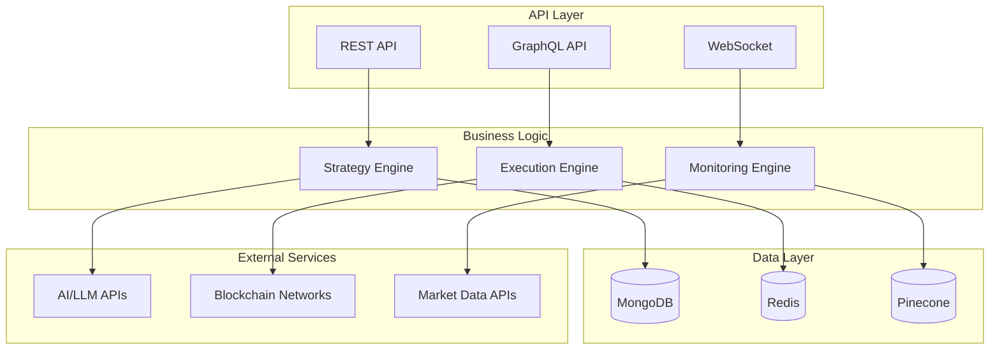

# Yetify Backend - AI-Powered DeFi Yield Strategies

<div align="center">


**Transform natural language prompts into executable DeFi strategies**

[](https://github.com/Yetifi/Yetify-agent/actions)
[](https://codecov.io/gh/Yetifi/Yetify-agent)
[](https://opensource.org/licenses/MIT)
[](https://nodejs.org/)
[](https://www.typescriptlang.org/)

</div>

## 🚀 Overview

Yetify Backend is a comprehensive AI-powered system for generating, executing, and monitoring DeFi yield strategies across multiple blockchains. Built with enterprise-grade architecture, it provides seamless integration between AI strategy generation and blockchain execution.

### 🌟 Key Features

- **🧠 AI Strategy Generation**: Advanced LLM integration with RAG for intelligent strategy creation
- **⛓️ Multi-Chain Execution**: Native support for Ethereum, NEAR, Arbitrum, and more
- **📊 Real-Time Monitoring**: Performance tracking, risk alerts, and automated rebalancing
- **🔒 Enterprise Security**: JWT authentication, rate limiting, and wallet signature verification
- **📈 Market Intelligence**: Live data feeds from multiple DeFi protocols and price oracles
- **🐳 Production Ready**: Docker containerization with comprehensive monitoring stack

## 🛠 Tech Stack

| Category | Technologies |
|----------|-------------|
| **Runtime** | Node.js 18+, TypeScript 5.3+ |
| **Framework** | Express.js, Apollo GraphQL |
| **Database** | MongoDB 7.0+, Redis 7.0+ |
| **AI/ML** | OpenAI GPT-4, Google Gemini, Pinecone Vector DB |
| **Blockchain** | Ethers.js, NEAR SDK, Web3.js |
| **Testing** | Jest, Supertest, MongoDB Memory Server |
| **Monitoring** | Prometheus, Grafana, Winston |
| **Security** | Helmet, Rate Limiting, Input Validation |
| **Deployment** | Docker, Docker Compose, GitHub Actions |

## 📋 Prerequisites

Before running Yetify Backend, ensure you have:

- **Node.js** 18.0.0 or higher
- **npm** 8.0.0 or higher
- **MongoDB** 7.0+ (or Docker for containerized setup)
- **Redis** 7.0+ (or Docker for containerized setup)
- **Git** for version control

## 🚀 Quick Start

### Option 1: Docker Setup (Recommended)

1. **Clone the Repository**
   ```bash
   git clone https://github.com/Yetifi/Yetify-agent.git
   cd Yetify-agent/yetify-backend
   ```

2. **Environment Configuration**
   ```bash
   cp .env.example .env
   # Edit .env with your API keys and configuration
   ```

3. **Start with Docker Compose**
   ```bash
   # Production deployment
   docker-compose up -d
   
   # Development with hot reload
   docker-compose -f docker-compose.dev.yml up
   ```

4. **Verify Installation**
   ```bash
   curl http://localhost:3001/health
   ```

### Option 2: Local Development

1. **Install Dependencies**
   ```bash
   npm install
   ```

2. **Setup Local Services**
   ```bash
   # Start MongoDB and Redis (with Docker)
   docker-compose up mongodb redis -d
   ```

3. **Environment Setup**
   ```bash
   cp .env.example .env
   # Configure your environment variables
   ```

4. **Development Server**
   ```bash
   npm run dev
   ```

## ⚙️ Configuration

### Required Environment Variables

```env
# Core Configuration
NODE_ENV=development
PORT=3001
MONGODB_URI=mongodb://localhost:27017/yetify
REDIS_URL=redis://localhost:6379

# Security
JWT_SECRET=your_secure_jwt_secret_here
ENCRYPTION_KEY=your_32_character_encryption_key

# AI Services
OPENAI_API_KEY=your_openai_api_key
GEMINI_API_KEY=your_gemini_api_key
PINECONE_API_KEY=your_pinecone_api_key
PINECONE_ENVIRONMENT=your_pinecone_environment
PINECONE_INDEX=yetify-strategies

# Blockchain Networks
ETHEREUM_RPC_URL=https://mainnet.infura.io/v3/your_key
NEAR_NODE_URL=https://rpc.testnet.near.org
ARBITRUM_RPC_URL=https://arb1.arbitrum.io/rpc

# External APIs
COINGECKO_API_KEY=your_coingecko_api_key
ETHERSCAN_API_KEY=your_etherscan_api_key
```

### Optional Configuration

<details>
<summary>Click to expand optional configuration options</summary>

```env
# Rate Limiting
RATE_LIMIT_WINDOW_MS=900000
RATE_LIMIT_MAX_REQUESTS=100

# Logging
LOG_LEVEL=info
LOG_FILE_PATH=./logs/yetify-backend.log

# CORS
CORS_ORIGIN=http://localhost:3000,http://localhost:3001

# Monitoring
PROMETHEUS_PORT=9090
GRAFANA_PORT=3000
```

</details>

## 📡 API Endpoints

### REST API

The backend exposes comprehensive REST endpoints:

| Endpoint Category | Base Path | Description |
|------------------|-----------|-------------|
| **Health** | `/health` | Service health and status |
| **Strategies** | `/api/v1/strategies` | Strategy CRUD operations |
| **Execution** | `/api/v1/execution` | Strategy execution and monitoring |
| **Monitoring** | `/api/v1/monitoring` | Performance analytics and alerts |

### GraphQL API

- **Endpoint**: `http://localhost:3001/graphql`
- **Playground**: Available in development mode
- **Schema**: Full type-safe schema with queries, mutations, and subscriptions

### Key Endpoints

```bash
# Health Check
GET /health

# Generate AI Strategy
POST /api/v1/strategies/generate
{
  "prompt": "Maximize my ETH yield with low risk",
  "riskTolerance": "low",
  "investmentAmount": 5000
}

# Execute Strategy
POST /api/v1/execution/execute
{
  "strategyId": "strategy_123",
  "investmentAmount": 5000,
  "slippageTolerance": 2
}

# Get Performance Metrics
GET /api/v1/monitoring/performance/{strategyId}
```

## 🧪 Testing

Yetify Backend includes comprehensive testing with high coverage:

```bash
# Run all tests
npm test

# Run tests with coverage
npm run test:coverage

# Run specific test types
npm run test:unit
npm run test:integration
npm run test:e2e

# Watch mode for development
npm run test:watch
```

### Test Coverage

- **Unit Tests**: Core business logic, AI engine, execution engine
- **Integration Tests**: API endpoints, database operations
- **End-to-End Tests**: Complete user workflows
- **Performance Tests**: Load testing and benchmarks

## 📊 Monitoring & Observability

### Health Checks

- **Application Health**: `GET /health`
- **Database Health**: `GET /api/v1/monitoring/health-check`
- **Docker Health**: Built-in container health checks

### Metrics & Dashboards

- **Prometheus**: Custom metrics for strategies, executions, and performance
- **Grafana**: Pre-configured dashboards for system monitoring
- **Logs**: Structured JSON logging with correlation IDs

### Monitoring Stack

```bash
# Access monitoring services
http://localhost:9090   # Prometheus
http://localhost:3000   # Grafana (admin/password from env)
http://localhost:3100   # Loki (logs)
```

## 🏗 Architecture



### Core Components

- **Strategy Engine**: AI-powered strategy generation with RAG
- **Execution Engine**: Multi-chain transaction execution
- **Monitoring Engine**: Real-time performance tracking
- **Market Data Services**: Live protocol and price data
- **Authentication**: JWT with wallet signature verification

## 🚢 Deployment

### Development

```bash
# Local development with hot reload
npm run dev

# Development with Docker
docker-compose -f docker-compose.dev.yml up
```

### Production

```bash
# Build and deploy
npm run build
npm run start

# Docker production deployment
docker-compose up -d

# With custom environment
docker-compose --env-file .env.production up -d
```

### Environment-Specific Configs

- **Development**: Hot reload, debug logging, test databases
- **Staging**: Production-like environment for testing
- **Production**: Optimized builds, security hardening, monitoring

## 🔒 Security

### Security Features

- **Authentication**: JWT tokens with wallet signature verification
- **Authorization**: Role-based access control
- **Rate Limiting**: Per-user and per-endpoint protection
- **Input Validation**: Joi schema validation for all inputs
- **Security Headers**: Helmet.js for security headers
- **CORS**: Configurable cross-origin resource sharing

### Security Best Practices

- All sensitive data encrypted at rest
- API keys stored in environment variables
- Regular security audits and dependency updates
- Private key handling through secure wallet integrations
- Rate limiting to prevent abuse

## 🤝 Contributing

We welcome contributions! Please see our [Contributing Guide](CONTRIBUTING.md) for details.

### Development Workflow

1. **Fork** the repository
2. **Create** a feature branch
3. **Write** tests for new functionality
4. **Ensure** all tests pass
5. **Submit** a pull request

### Code Standards

- **TypeScript**: Strict type checking enabled
- **ESLint**: Airbnb configuration with custom rules
- **Prettier**: Automated code formatting
- **Husky**: Pre-commit hooks for quality assurance

## 📈 Performance

### Benchmarks

- **Response Time**: < 200ms for API calls
- **Throughput**: 1000+ requests/second
- **Memory Usage**: < 512MB under normal load
- **Database**: Optimized queries with proper indexing

### Optimization Features

- **Redis Caching**: Aggressive caching of market data
- **Connection Pooling**: Efficient database connections
- **Lazy Loading**: On-demand service initialization
- **Compression**: Gzip compression for API responses

## 🆘 Troubleshooting

### Common Issues

<details>
<summary>Service won't start</summary>

1. Check if MongoDB and Redis are running
2. Verify environment variables are set
3. Ensure Node.js version is 18+
4. Check logs for specific error messages

```bash
# Check service status
docker-compose ps

# View logs
docker-compose logs yetify-backend
```

</details>

<details>
<summary>AI Strategy generation fails</summary>

1. Verify AI API keys are configured
2. Check network connectivity to AI services
3. Review rate limits for AI APIs
4. Ensure Pinecone vector database is accessible

</details>

<details>
<summary>Blockchain execution errors</summary>

1. Verify RPC URLs are correct and accessible
2. Check wallet connection and permissions
3. Ensure sufficient gas/balance for transactions
4. Review network-specific configurations

</details>

### Getting Help

- **Documentation**: [Full Documentation](https://docs.yetify.ai)
- **Issues**: [GitHub Issues](https://github.com/Yetifi/Yetify-agent/issues)
- **Discussions**: [GitHub Discussions](https://github.com/Yetifi/Yetify-agent/discussions)
- **Discord**: [Community Server](https://discord.gg/yetify)

## 📄 License

This project is licensed under the MIT License - see the [LICENSE](LICENSE) file for details.

## 🙏 Acknowledgments

- **NEAR Foundation**: For blockchain infrastructure and support
- **OpenAI & Google**: For AI/LLM capabilities
- **DeFi Community**: For protocols and integrations
- **Open Source Contributors**: For the amazing ecosystem

---

<div align="center">

**Built with ❤️ by the Yetify Team**

[Website](https://yetify.ai) • [Documentation](https://docs.yetify.ai) • [Discord](https://discord.gg/yetify) • [Twitter](https://twitter.com/YetifyAI)

</div>
